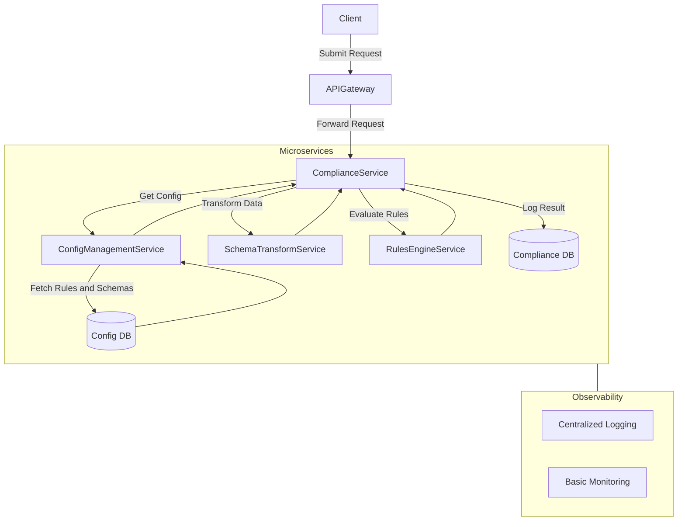
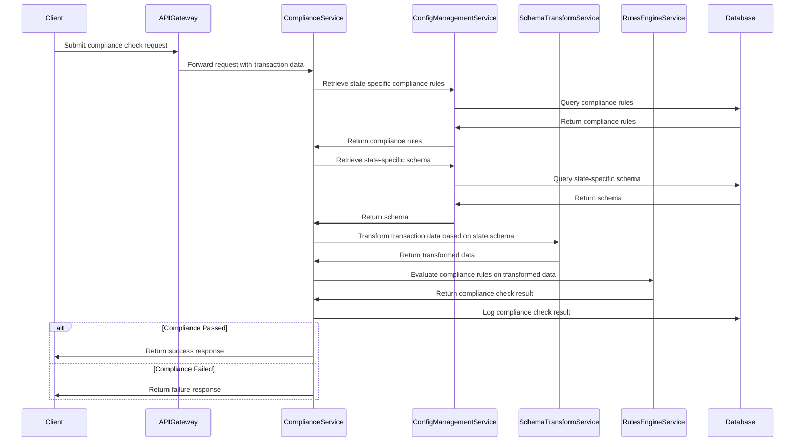

# Compliance Service Design (Advanced)

## Compliance Service

This is a new compliance service to modularize the existing code base. Each US state can have its own regulatory and compliance laws, which necessitate runtime injection of logic to map data schema to the expectations and schemas of each marketspace. 

### High-Level Design for Advanced Approach

#### 1. Architecture Overview
To build the compliance service that allows runtime configuration for different state regulations, we can leverage a microservices architecture. This architecture will modularize the existing monolith application, making it easier to inject different compliance logic at runtime. The core components of this system will include:

1. **Compliance Service**: The main service responsible for handling compliance checks and transformations.
2. **Configuration Management Service**: A service to manage and retrieve compliance rules and mappings for each state.
3. **Schema Transformation Service**: A service that maps data schema to each state's schema.
4. **Rule Engine Service**: A dynamic rule engine to evaluate compliance rules.
5. **API Gateway**: Routes requests to appropriate microservices and handles authentication and rate limiting.

#### 2. Component Breakdown
- **Compliance Service**: This service will act as the entry point for all compliance-related requests. It will validate and process requests based on the current state's compliance rules.
- **Configuration Management Service**: A centralized service that stores all state-specific rules and schema mappings in a database (preferably NoSQL for flexibility). This service will be responsible for dynamically providing configurations to the Compliance Service.
- **Schema Transformation Service**: A service to handle the transformation of data schemas. It will use the configurations provided by the Configuration Management service to transform data according to the state's requirements.
- **Rule Engine Service**: This component will evaluate rules based on the configurations.
- **API Gateway**: Acts as a façade to the outside world, routing requests to the appropriate services and handling cross-cutting concerns like authentication, rate limiting, and logging.

#### 3. Project Management
- **Phase 1**: Requirement Gathering and Planning
  - Identify all compliance requirements across different states.
  - Define data schemas for each state.
  - Design the overall architecture and select technologies.
- **Phase 2**: Core Service Development
  - Develop the core Compliance Service.
  - Implement Configuration Management and Schema Transformation services.
- **Phase 3**: Rule Engine and Integration
  - Develop or integrate a rule engine.
  - Integrate all components and ensure they work seamlessly.
- **Phase 4**: Testing and Deployment
  - Extensive testing, including unit, integration, and load testing.
  - Gradual deployment, starting with a few states and progressively adding more.
- **Phase 5**: Migration and Monitoring
  - Migrate existing compliance logic from the monolith to the new service.
  - Implement monitoring and logging for all services.
- **Phase 6**: Incremental Improvements
  - Gather user feedback and iterate on the product.

#### 4. Cost-Effective Monitoring and Logging
- Ensure all services are properly monitored and logs are collected for auditing purposes.
- Start with basic logging using existing or built-in tools.
- Implement basic monitoring with tools like AWS CloudWatch.
- Integrate more advanced observability solutions like Datadog as the product and budget allow.

### Conclusion
By breaking down the project into clear phases and focusing on modular design, the compliance service can be built in a scalable and maintainable way, ensuring adherence to varying state regulations efficiently.