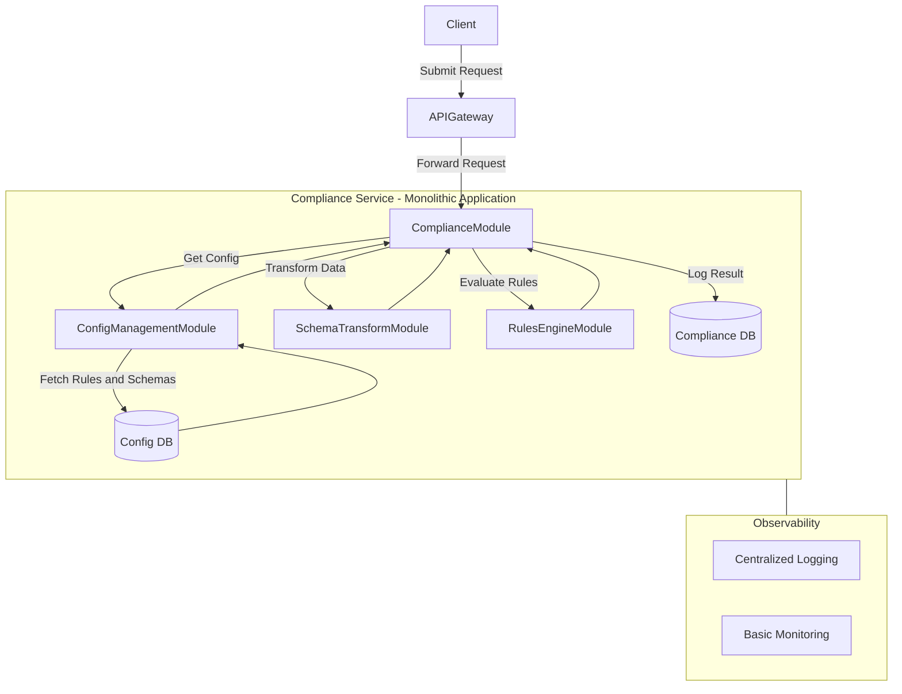
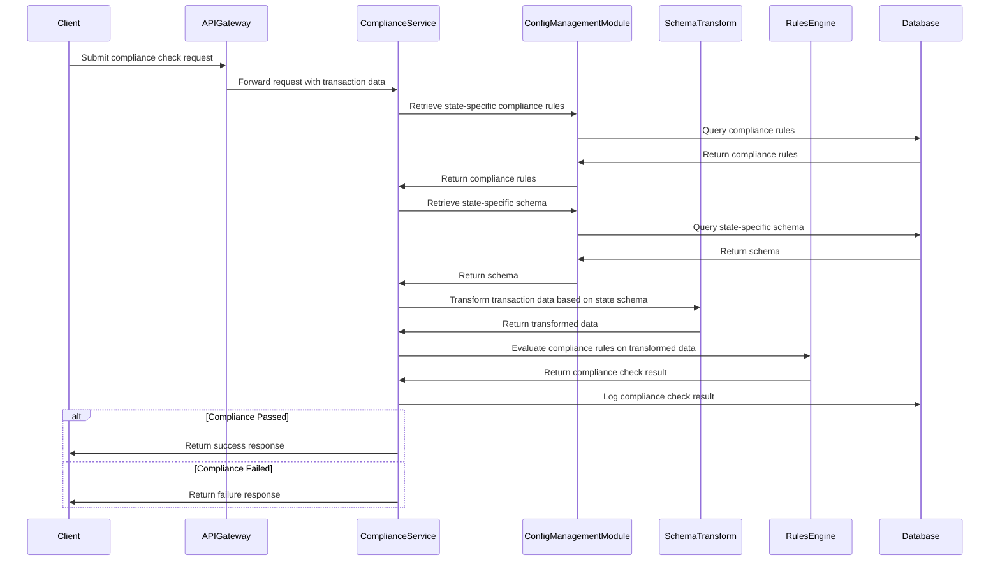

# Compliance Service Design (Simplified)

## Compliance Service

This is a new compliance service to modularize the existing code base. Each US state can have its own regulatory and compliance laws, which necessitate runtime injection of logic to map data schema to the expectations and schemas of each marketspace.

### High-Level Design for Simplified Approach

#### 1. Architecture Overview
- **Monolithic Core with Modular Components**:
  - Develop a monolithic application initially, with clearly defined modules for Compliance Service, Configuration Management, and Schema Transformation. This can be later refactored into microservices as the need arises.
- **Tech Stack**:
  - Use Node.js for the back-end with PostgreSQL for data storage.
  - Deploy on a cloud platform like AWS, using cost-effective services (e.g., AWS RDS for PostgreSQL).

#### 2. Component Breakdown
- **Compliance Module**:
  - Centralize compliance logic in a single module within the monolithic application. This module handles all compliance-related checks and operations, ensuring adherence to state-specific regulations.
- **Configuration Management Module**:
  - Store compliance rules and configurations in PostgreSQL.
- **Schema Transformation Module**:
  - Implement transformation logic within the same monolith, but structure it as a separate module.
- **Rules Engine Module**:
  - Embed a rule engine within the monolithic application to evaluate compliance rules.

#### 3. Project Management
- **Phase 1**: Requirement Gathering and Planning
  - Identify all compliance requirements across different states.
  - Define data schemas for each state.
  - Design the overall architecture and select technologies.
- **Phase 2**: Core Feature Development
  - Implement the core compliance logic, configuration management, schema transformation, and rules engine within a monolithic structure.
- **Phase 3**: Testing and Deployment
  - Conduct unit and integration testing.
  - Deploy the monolith to a cloud environment.
- **Phase 4**: Migration and Monitoring
  - Migrate existing compliance logic from the monolith to the new service.
  - Implement monitoring and logging.
- **Phase 5**: Incremental Improvements
  - Gather user feedback and iterate on the product.
  - Gradually refactor the monolithic components into microservices as needed.

#### 4. Cost-Effective Monitoring and Logging
- Ensure all services are properly monitored and logs are collected for auditing purposes.
- Start with basic logging using existing or built-in tools.
- Implement basic monitoring with tools like AWS CloudWatch.
- Integrate more advanced observability solutions like Datadog as the product and budget allow.

### Conclusion
By starting with a monolithic architecture that is modular, we can quickly develop and deploy the compliance service, and iteratively improve the product. This approach balances the need for speed and cost-efficiency with the ability to scale and adapt the architecture as we grow.